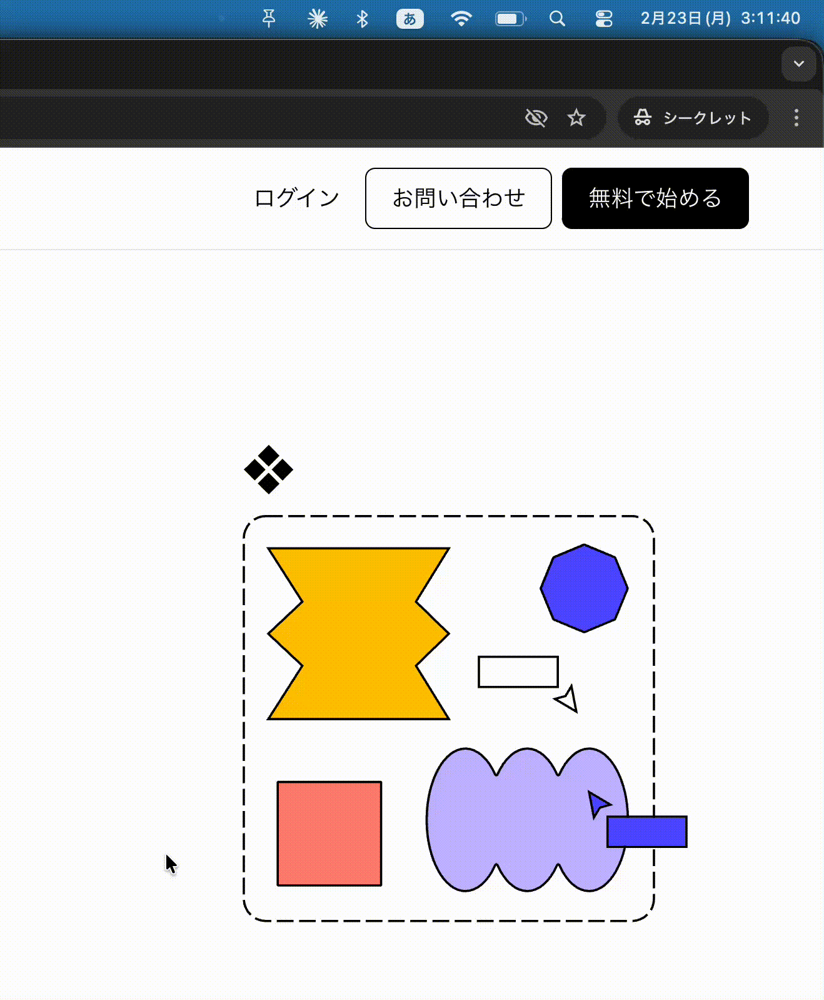

# SnapPin

画面の好きな範囲をキャプチャして、常に最前面に浮かべておけるmacOSメニューバーアプリです。

> [!NOTE]
> このプロジェクトは [Claude Code](https://claude.ai/code) を使ったバイブコーディングで作られています。
> 

## 機能

- **範囲キャプチャ** — メニューバーアイコンをクリックして範囲をドラッグすると、その部分が浮かぶウィンドウとして表示される
- **画像のドラッグ&ドロップ** — メニューバーアイコンに画像ファイルをドロップして表示できる
- **常に最前面** — 浮かぶウィンドウは他のウィンドウより常に手前に表示される
- **透明度の調整** — ウィンドウ上でスクロールして透明度を変更できる

## 使い方

| 操作 | 内容 |
|------|------|
| メニューバーアイコンを左クリック | 範囲選択モードを開始 |
| 画面上をドラッグ | キャプチャ範囲を選択 |
| 選択中に Esc | キャンセル |
| メニューバーアイコンに画像をドロップ | 画像を浮かぶウィンドウとして表示 |
| 浮かぶウィンドウ上でスクロール | 透明度を調整 |
| 浮かぶウィンドウをドラッグ | 位置を移動 |
| 浮かぶウィンドウをダブルクリック | 閉じる |
| 浮かぶウィンドウで Esc | 閉じる |
| 浮かぶウィンドウを右クリック | メニューを表示（閉じる） |
| メニューバーアイコンを右クリック | 設定メニュー（自動起動 / 終了） |

## ライセンス

MIT
